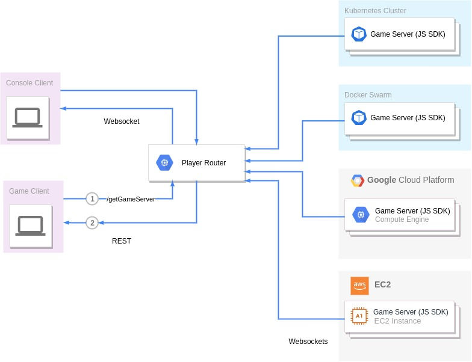
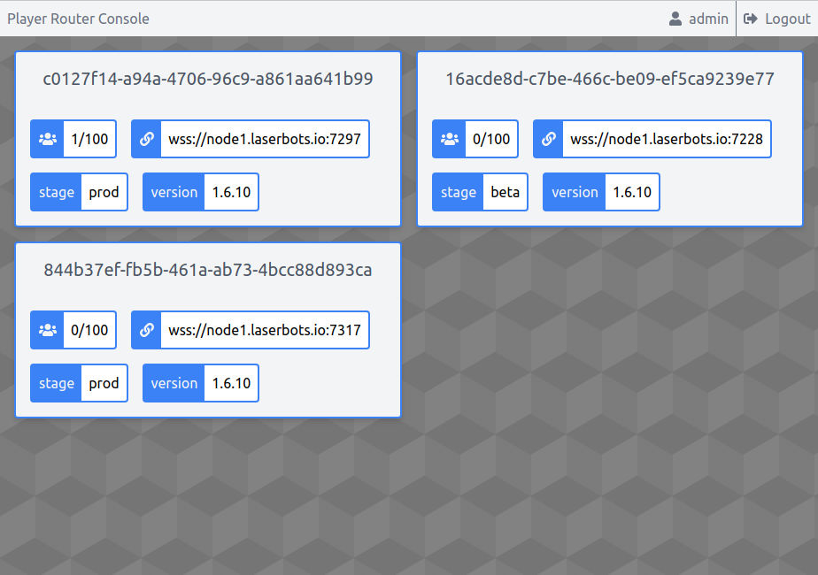

# Player Router

 
 

Player Router is a game server discovery and player load balancing tool for your cluster of game servers.

It it desinged to be infratructure and container orchestration agnostic, in order to simplify your game server deployments as much as possible.

## How it works

 
 

Each of your game servers will each connect to the Player Router server via the javsacript SDK (which internally will use a websocket connection).
 The Player Router exposes REST endpoints for your game clients to query, which will return the URL of the most suitable game server at that given time.

## Console
You may (optionally) use the console client to log into the Player Router server and view (in realtime) information about your game servers.

 
 
You can use my hosted console at <a href="https://console.jakapp.io">console.jakapp.io</a> or <a href="https://github.com/jakapps/player-router/wiki/Installation#optional-add-the-console-to-your-deployment">deploy your own</a>.

## Features
Detailed list of features available on the <a href="https://github.com/jakapps/player-router/wiki/Features">Wiki</a>.

## Installation
Installation instructions available on the <a href="https://github.com/jakapps/player-router/wiki/Installation">Wiki</a>.
